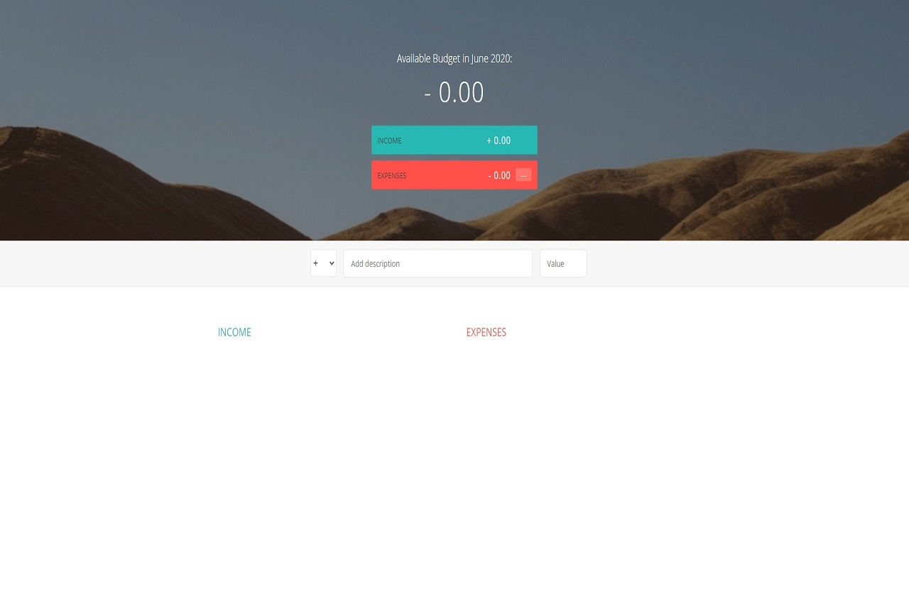

# Expense Tracker
The expense tracker is able to accept incomes and expenses as input and 
provide the user with their available budget in a given month. It also
will provide the user with what percent of income each expense is.

# Motivation
This projects exists because I wanted to expand my JavaScript skills by 
setting user data via the DOM elements.
It was challenging trying to get each DOM element to update as the user 
input was updated.

# Screenshots

# Tech used
**Built with**  
&nbsp;&nbsp;-HTML  
&nbsp;&nbsp;-SASS  
&nbsp;&nbsp;-JavaScript  
  
# Features
Percentage of income calculator. It will update real-time with what percent
of income your expenses are.

# Code Example
    var budgetController = (function() {

      var Expense = function(id, description, value) {
          this.id  = id;
          this.description = description;
          this.value = value;
          this.percentage = -1;
      };

      Expense.prototype.calcPercentage = function(totalIncome) {
          if (totalIncome > 0) {
              this.percentage = Math.round((this.value / totalIncome) * 100);
          } else {
              this.percentage = -1;
          }
      };

# Installation
npm install expense_tracker
